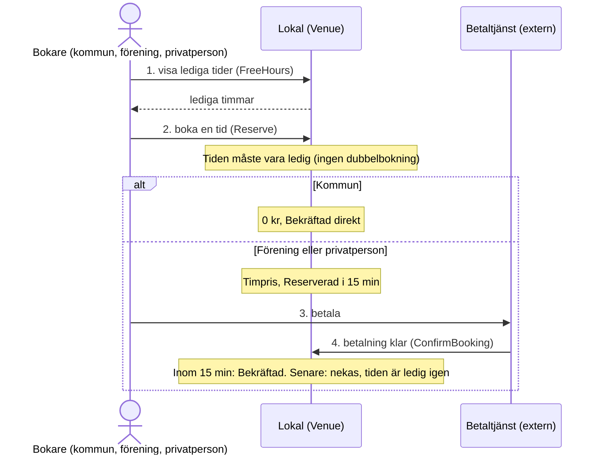
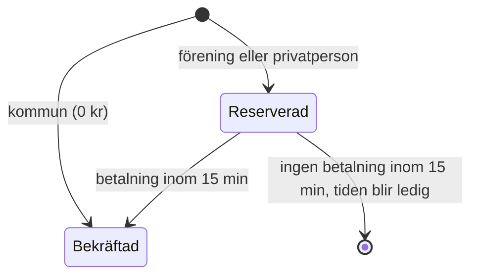
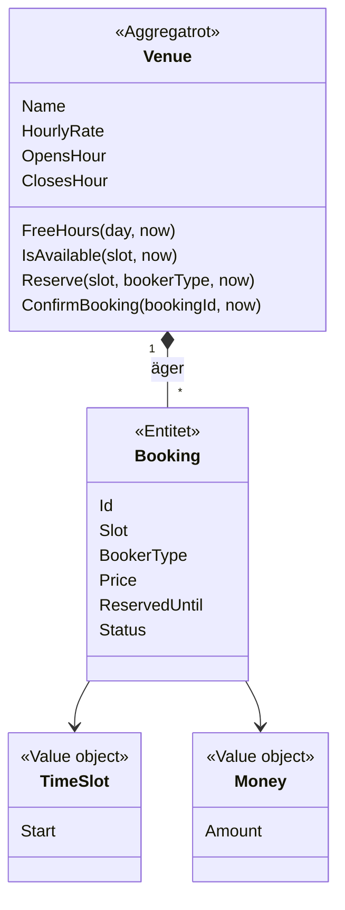

# Bokningssystem för kommunala lokaler – MVP

En minimal domänmodell (DDD, tactical design) för att boka kommunala lokaler.
Det finns inget UI, API eller databas. Modellen körs och verifieras genom testerna (`dotnet test`).

## Problemet

- Kommunen hyr ut lokaler till kommunanställda, föreningar och privatpersoner.
- Man väljer lokal och bokar en ledig tid.
- Bokningen går igenom när betalningen är klar. Fram till dess är den **reserverad**.
- Kommunen betalar inget. Deras bokning går igenom direkt.
- Man vill se vad som är ledigt och upptaget.
- Tidigare problem:
  - **dubbelbokningar**: man kommer fram och lokalen är upptagen;
  - **glömda bokningar**: lediga lokaler står som upptagna.

## Domain story: boka en lokal

## Bokningens livscykel

Inget bakgrundsjobb behöver städa gamla reservationer. En reservation blockerar tiden bara så
länge klockan är före `ReservedUntil`. Det löser problemet med glömda bokningar.

## Domänmodell

| Byggsten | Varför |
|---|---|
| `Venue` är **aggregatrot** | Regeln "ingen dubbelbokning" gäller alla bokningar i en lokal. Alla ändringar går därför genom `Venue`. |
| `Booking` är **entitet** | Har en identitet och en status som ändras över tid. Kan bara ändras via `Venue`. |
| `TimeSlot`, `Money` är **value objects** | Saknar identitet och validerar sig själva. En tid som inte börjar på hel timme eller ett negativt belopp kan inte skapas. |

## Regler i MVP:n

| Regel | Test |
|---|---|
| En tid är en hel timme | `TimeSlotTests` |
| Bara inom öppettider och aldrig bakåt i tiden | `VenueReserveTests` |
| Samma tid kan inte bokas två gånger | `VenueReserveTests` |
| Kommun: 0 kr, bekräftad direkt. Övriga: timpris, reserverad | `VenueReserveTests` |
| En reservation håller tiden i 15 min | `ReservationTimeoutTests` |
| En betalning bekräftar bara inom 15 min | `ConfirmBookingTests` |
| Lediga tider visas per dag | `FreeHoursTests` |

## Antaganden (inte verifierade krav)

- 15 minuters reservationstid.
- Bokning i hela timmar, en timme i taget.
- Fast timpris per lokal.
- Samma öppettider alla dagar.

## Inte med i MVP:n

Avbokning, återbetalning, sena betalningar, flertimmarsbokningar, samtidiga anrop, lagring, UI och API.
Det är naturliga nästa steg.
